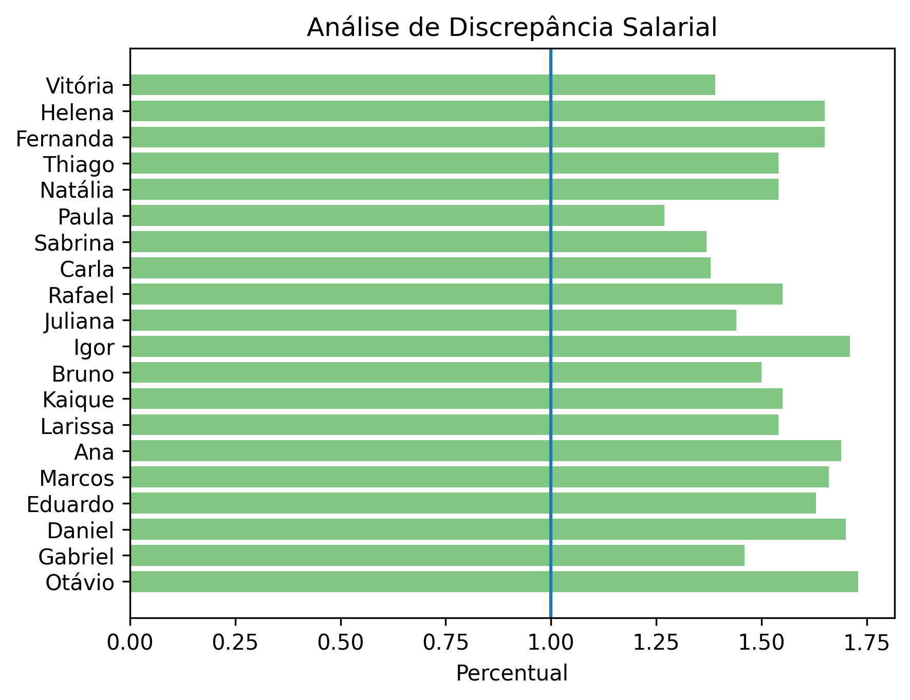

# 📊 Análise de Discrepância Salarial por Área

## 🎯 Objetivo

Este projeto tem como objetivo identificar possíveis **desigualdades salariais** dentro de diferentes áreas de uma empresa, utilizando análise de dados com Python.

A proposta é comparar salários individuais com o padrão da sua área, permitindo uma análise mais justa e contextualizada.

---

## 🧠 Metodologia

A análise foi construída em etapas:

* Agrupamento dos dados por área
* Cálculo da **mediana salarial por área** (mais robusta que a média)
* Comparação do salário individual com a mediana
* Criação de métricas:

  * Diferença absoluta
  * Percentual em relação à mediana
* Classificação dos funcionários:

  * Abaixo do mercado
  * Dentro da média
  * Acima do mercado
* Identificação de **outliers** com base em regra de negócio (desvio maior que 30%)
* Ranking de salários dentro de cada área
* Filtragem de possíveis casos de desigualdade mais crítica

---

## 📊 Principais Insights

* Foi possível identificar funcionários com salários significativamente abaixo da mediana da área
* A utilização da mediana evitou distorções causadas por valores extremos
* A análise por percentual permitiu comparar áreas diferentes de forma justa
* A combinação de classificação + outliers ajudou a destacar casos mais críticos

---

## 🛠️ Tecnologias utilizadas

* Python
* Pandas
* NumPy
* Matplotlib

---

## 📈 Visualização

O projeto inclui um gráfico de barras horizontais que mostra o percentual salarial de cada funcionário em relação à mediana da sua área, destacando:

* 🔴 Abaixo do esperado
* ⚪ Dentro da média
* 🟢 Acima do esperado

---

## ⚠️ Limitações

* A definição de limites (ex: 20% ou 30%) foi baseada em regra de negócio simplificada
* Não foram utilizados métodos estatísticos mais avançados (como IQR), priorizando clareza e interpretabilidade
* Os dados utilizados são fictícios

---

## 🚀 Possíveis melhorias

* Implementar detecção de outliers com métodos estatísticos (IQR)
* Utilizar mediana e média em conjunto para análise comparativa
* Criar dashboard interativo (ex: Power BI ou Streamlit)
* Expandir análise para outros fatores (tempo de empresa, cargo, etc.)

---

## 📁 Estrutura do projeto

```
projeto_python_01/
│
├── data/
│   └── dados_pessoas.csv
├── src/
│   └── analise.py
├── imagens/
│   └── grafico.png
└── README.md
```

---

## 💬 Conclusão

Este projeto demonstra a aplicação de análise de dados para identificar padrões e possíveis desigualdades salariais, utilizando conceitos como agrupamento, métricas comparativas e visualização de dados.

Mais do que gerar resultados, o foco foi construir uma análise clara, interpretável e alinhada com problemas reais de negócio.
